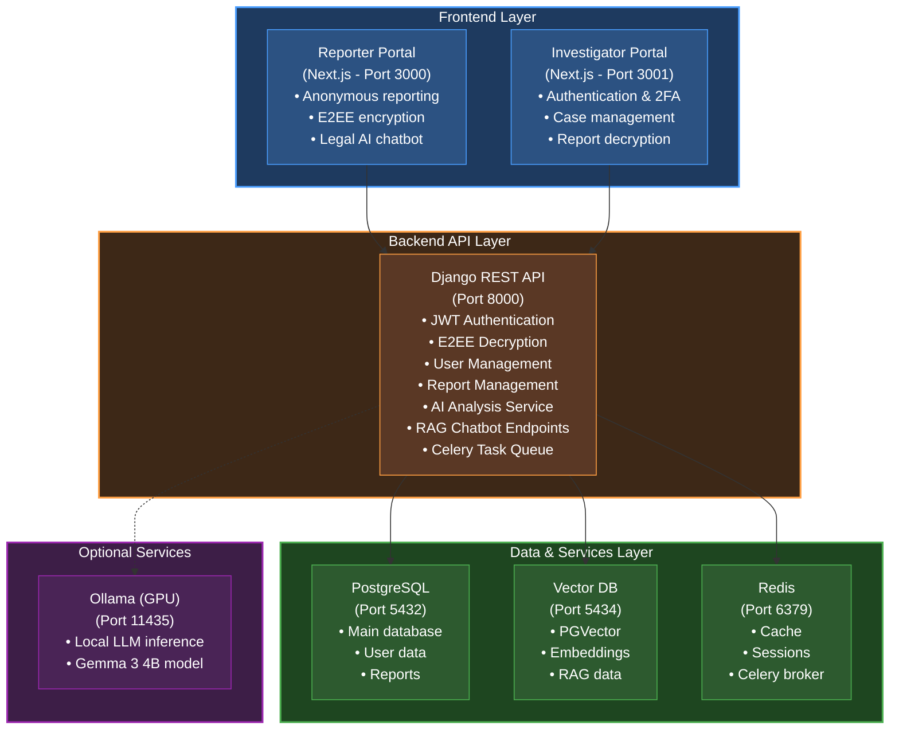

# Sirr - Secure Incident Reporting & Response

<div align="center">

**A comprehensive end-to-end encrypted platform for secure, anonymous crime reporting and investigation management**

[](https://www.python.org/)
[](https://www.djangoproject.com/)
[](https://nextjs.org/)
[](https://www.typescriptlang.org/)
[](https://www.docker.com/)

</div>

## 📋 Table of Contents

- [Overview](#-overview)
- [Key Features](#-key-features)
- [Architecture](#-architecture)
- [Technology Stack](#-technology-stack)
- [Prerequisites](#-prerequisites)
- [Setup and Installation](#-setup-and-installation)
- [Running the Project](#-running-the-project)
- [Project Structure](#-project-structure)
- [Development Workflow](#-development-workflow)
- [Security Features](#-security-features)
- [Additional Documentation](#-additional-documentation)

## 🎯 Overview

**Sirr** (Arabic: سِرّ, meaning "secret") is a secure, anonymous reporting platform designed to enable safe submission and management of sensitive reports. The system provides end-to-end encryption (E2EE), AI-powered analysis, and comprehensive investigation tools for caseworkers.

### Purpose

- **For Reporters**: Submit anonymous reports securely with end-to-end encryption, ensuring complete privacy
- **For Investigators**: Manage, analyze, and track reports through a comprehensive case management portal
- **For Organizations**: Deploy a trusted, secure platform for handling sensitive information

## ✨ Key Features

### Reporter Portal
- 🔒 **End-to-End Encryption**: All reports encrypted using XChaCha20-Poly1305 with X25519 key exchange
- 🎭 **Complete Anonymity**: No user accounts or tracking required for report submission
- 📱 **Multi-language Support**: Arabic and English interfaces
- 📎 **Secure Attachments**: Encrypted file uploads with support for multiple formats
- 🤖 **AI Legal Assistant**: RAG-based chatbot for legal guidance (Egyptian law)
- 📋 **Dynamic Forms**: Category-specific report templates

### Investigator Portal
- 👤 **Secure Authentication**: JWT-based auth with TOTP 2FA support
- 📊 **Case Management**: Advanced filtering, sorting, and search capabilities
- 🔐 **Decryption System**: Secure report decryption with role-based access
- 📈 **AI Analysis**: Automated spam detection and urgency classification
- 📝 **Investigation Logs**: Track case progress and actions
- 🗂️ **Evidence Management**: Organize and manage case-related files

### Backend Features
- 🤖 **AI-Powered Analysis**: DSPy-based spam detection and urgency classification
- 🔄 **Async Task Processing**: Celery-based background job processing
- 🗄️ **Vector Database**: PGVector for RAG chatbot embeddings
- 🔑 **Cryptographic Security**: PyNaCl-based encryption system
- 📊 **RESTful API**: Django REST Framework with comprehensive endpoints
- 🔐 **Password Security**: Pwned Passwords integration, Argon2 hashing

## 🏗️ Architecture

### High-Level System Architecture



## 🛠️ Technology Stack

### Backend
- **Framework**: Django 5.2+ with Django REST Framework
- **Language**: Python 3.13+
- **Database**: PostgreSQL 17.5 with PGVector extension
- **Cache/Queue**: Redis 6.4+ with Celery 5.5+
- **AI/ML**: DSPy 3.0+, LangChain 0.3+, LiteLLM 1.77
- **Cryptography**: PyNaCl 1.6+ (XChaCha20-Poly1305, X25519)
- **Authentication**: JWT (djangorestframework-simplejwt), PyOTP (TOTP)
- **Package Manager**: uv (fast Python package manager)
- **Task Runner**: poethepoet (poe)

### Frontend
- **Framework**: Next.js 15.2+ (App Router)
- **Language**: TypeScript 5.0+
- **UI Library**: React 19+
- **Styling**: Tailwind CSS 4.1+
- **Components**: Radix UI, shadcn/ui
- **Cryptography**: TweetNaCl (client-side encryption)
- **State Management**: React Context API
- **HTTP Client**: Axios 1.12+

### Infrastructure
- **Containerization**: Docker & Docker Compose
- **Databases**:
  - PostgreSQL 17.5 (main database)
  - PGVector (vector embeddings)
  - Redis 6.4+ (cache & message broker)
- **Optional**: Ollama (local LLM inference with GPU support)

### Development Tools
- **Backend**: Ruff (linting/formatting), MyPy (type checking)
- **Frontend**: ESLint, TypeScript compiler
- **Version Control**: Git

## 📦 Prerequisites

Before setting up the project, ensure you have the following installed:

### Required Software

1. **Docker & Docker Compose**
   - Docker Desktop 20.10+ (includes Docker Compose)
   - [Download Docker](https://docs.docker.com/get-docker/)

2. **Python 3.13+**
   - Required for local development and running scripts
   - [Download Python](https://www.python.org/downloads/)

3. **uv (Python Package Manager)**
   - Fast Python package installer and resolver
   - Installation:
     ```bash
     # Unix/macOS
     curl -LsSf https://astral.sh/uv/install.sh | sh

     # Windows (PowerShell)
     powershell -ExecutionPolicy ByPass -c "irm https://astral.sh/uv/install.ps1 | iex"
     ```
   - [uv Documentation](https://docs.astral.sh/uv/)

4. **Node.js 18+ and npm/yarn**
   - Required for frontend development
   - [Download Node.js](https://nodejs.org/)

### Optional Software

5. **Ollama** (for local LLM inference)
   - Only needed if using local AI models
   - [Download Ollama](https://ollama.com/download)
   - See `backend/README_OLLAMA.md` for setup instructions

### System Requirements

- **RAM**: Minimum 8GB (16GB recommended)
- **Storage**: 10GB free space
- **GPU**: Optional, for Ollama (NVIDIA GPU with CUDA support)

## 🚀 Setup and Installation

### 1. Clone the Repository

```bash
git clone https://github.com/ysif9/sirr
cd sirr
```

### 2. Environment Configuration

Create your environment file from the template:

```bash
cp .env.example .env
```

Edit `.env` and configure the following key variables:

```bash
# Django Settings
DJANGO_SECRET_KEY=your-secret-key-here-make-it-long-and-random
DEBUG=True
DJANGO_ALLOWED_HOSTS=localhost,127.0.0.1,0.0.0.0

# Database Configuration
POSTGRES_DB_NAME=sirr_dev
POSTGRES_DB_USER=postgres
POSTGRES_DB_PASSWORD=postgres

# AI Service API Keys (Optional - for AI features)
OPENAI_API_KEY=your-openai-key-here
GOOGLE_API_KEY=your-google-api-key-here
TAVILY_API_KEY=your-tavily-key-here

# Admin Credentials (Development)
DJANGO_SUPERUSER_USERNAME=admin
DJANGO_SUPERUSER_EMAIL=admin@sirr.com
DJANGO_SUPERUSER_PASSWORD=admin

# Admin Private Key (Leave empty initially, will be generated)
ADMIN_PRIVATE_KEY=
```

### 3. Backend Setup

Navigate to the backend directory and install dependencies:

```bash
cd backend
uv sync
```

This will:
- Create a virtual environment
- Install all Python dependencies
- Set up development tools (Ruff, MyPy, etc.)

### 4. Build Docker Containers

Build all required Docker images:

```bash
# From the backend directory
poe build
```

This builds:
- Django API container
- PostgreSQL database
- Vector database (PGVector)
- Redis cache
- Celery worker

### 5. Initialize Database

Start the services and run migrations:

```bash
# Start all services
poe dev
```

The startup script automatically:
- Waits for PostgreSQL and Redis to be ready
- Runs database migrations
- Creates a default superuser (if configured in .env)

### 6. Create Admin User with Encryption Keys

In a **new terminal** (keep `poe dev` running), create an admin user with encryption keys:

```bash
cd backend

# Create admin user
poe create_test_admin --username=admin --email=admin@sirr.com --password=yourpassword
```

**Important**: Copy the `ADMIN_PRIVATE_KEY` from the output and add it to your `.env` file:

```bash
ADMIN_PRIVATE_KEY=<paste-the-generated-key-here>
```

Then restart the services:

```bash
# Stop services (Ctrl+C in the terminal running poe dev) or
poe down
# Restart services
poe dev
```

### 7. Frontend Setup

#### Reporter Portal (Port 3000)

```bash
cd frontend/reporter
npm install
# or
yarn install
```

#### Investigator Portal (Port 3001)

```bash
cd frontend/investigator
yarn install
```

### 8. (Optional) Initialize Vector Database for RAG Chatbot

If you want to use the legal AI chatbot feature:

```bash
cd backend

# Ensure you have GOOGLE_API_KEY set in .env for embeddings
# Load Egyptian law articles into vector database
poe loadvectors
```

This will:
- Process legal documents from `backend/chatbot/Data/`
- Generate embeddings using Google's Generative AI
- Store vectors in the PGVector database

### 9. (Optional) Setup Ollama for Local LLM

If you want to use local AI models for report analysis:

1. Install Ollama (see Prerequisites)
2. Pull the required model:
   ```bash
   ollama pull gemma3:4b
   ```
3. Configure `OLLAMA_PATH` in `.env`
4. Start services with Ollama profile:
   ```bash
   poe devlm
   ```

## 🎮 Running the Project

### Start All Services

#### Backend Services (Database, API, Celery, Redis)

```bash
cd backend

# Standard mode (without Ollama)
poe dev

# With Ollama for local LLM inference
poe devlm
```

The backend API will be available at: **http://localhost:8000**

- API Health Check: http://localhost:8000/api/health/
- Django Admin: http://localhost:8000/admin/
- API Documentation: http://localhost:8000/api/

#### Reporter Portal (Anonymous Reporting)

```bash
cd frontend/reporter
npm run dev
# or
yarn dev
```

Access at: **http://localhost:3000**

#### Investigator Portal (Case Management)

```bash
cd frontend/investigator
yarn dev
```

Access at: **http://localhost:3001**

### Default Ports

| Service | Port | URL |
|---------|------|-----|
| Django API | 8000 | http://localhost:8000 |
| Reporter Portal | 3000 | http://localhost:3000 |
| Investigator Portal | 3001 | http://localhost:3001 |
| PostgreSQL | 5432 | localhost:5432 |
| Vector DB (PGVector) | 5434 | localhost:5434 |
| Redis | 6379 | localhost:6379 |
| Ollama (optional) | 11435 | http://localhost:11435 |

### Stopping Services

```bash
# Stop backend services
cd backend
poe down

# Stop frontend (Ctrl+C in the terminal)
```

## 📁 Project Structure

```
sirr2/
├── backend/                      # Django REST API backend
│   ├── apps/                     # Django applications
│   │   ├── common/              # Shared models and utilities
│   │   ├── reports/             # Report management (models, views, serializers)
│   │   └── users/               # User authentication and management
│   ├── chatbot/                 # RAG chatbot implementation
│   │   ├── Data/                # Legal documents for embeddings
│   │   └── data_loading.py      # Vector database initialization
│   ├── core/                    # Django project settings
│   │   ├── settings.py          # Main configuration
│   │   ├── urls.py              # URL routing
│   │   └── celery.py            # Celery configuration
│   ├── media/                   # Uploaded files (encrypted)
│   ├── sirr-datasets/           # Training datasets for AI models
│   ├── manage.py                # Django management script
│   ├── pyproject.toml           # Python dependencies and tool config
│   ├── Dockerfile               # Docker image definition
│   └── README.md                # Backend-specific documentation
│
├── frontend/                    # Next.js frontend applications
│   ├── reporter/                # Anonymous reporting portal
│   │   ├── app/                 # Next.js app router pages
│   │   ├── components/          # React components
│   │   ├── contexts/            # React context providers
│   │   ├── lib/                 # Utilities and API clients
│   │   │   ├── api.ts           # Backend API client
│   │   │   ├── crypto-utils.ts  # Client-side encryption
│   │   │   └── rag-api.ts       # Chatbot API client
│   │   └── package.json         # Node.js dependencies
│   │
│   └── investigator/            # Case management portal
│       ├── app/                 # Next.js app router pages
│       ├── components/          # React components
│       ├── contexts/            # Authentication context
│       ├── lib/                 # Utilities and API clients
│       │   ├── api.ts           # Backend API client
│       │   └── crypto.ts        # Decryption utilities
│       └── package.json         # Node.js dependencies
│
├── docker-compose.yml           # Docker services orchestration
├── .env.example                 # Environment variables template
└── README.md                    # This file
```

## 🔐 Security Features

### End-to-End Encryption (E2EE)

1. **Client-Side Encryption**: Reports are encrypted in the browser before transmission
2. **Key Exchange**: X25519 elliptic curve Diffie-Hellman for secure key exchange
3. **Symmetric Encryption**: XChaCha20-Poly1305 AEAD for report body encryption
4. **Key Wrapping**: Report keys are encrypted for each authorized recipient
5. **Zero-Knowledge**: Server never has access to plaintext report data

### Authentication & Authorization

- **JWT Tokens**: Secure, stateless authentication with refresh token rotation
- **TOTP 2FA**: Time-based one-time passwords for additional security
- **Password Security**:
  - Argon2 hashing algorithm
  - Pwned Passwords API integration
  - Minimum complexity requirements
- **Role-Based Access**: Caseworker permissions for report access

### Data Protection

- **Encrypted Storage**: All sensitive data encrypted at rest
- **Secure File Uploads**: Attachments encrypted before storage
- **Access Logging**: Track who accessed which reports and when
- **Redaction System**: Remove sensitive information with audit trail

## 📚 Additional Documentation
- **[Backend README](backend/README.md)**: Detailed backend development guide
- **[Ollama Setup](docs/Ollama.md)**: Local LLM configuration
- **[Admin Keys Guide](docs/Admin-Keys.md)**: Encryption key management

## 🤝 Contributing

### Development Guidelines

1. **Code Style**: Follow existing patterns and use provided linters
2. **Type Safety**: Use TypeScript for frontend, type hints for Python
3. **Testing**: Write tests for new features (coming soon)
4. **Documentation**: Update relevant documentation for changes
5. **Commits**: Use clear, descriptive commit messages

## 👥 Authors

- Yousif Abdulhafiz - [@ysif9](https://github.com/ysif9)
- Philopater Guirgis - [@Philodoescode](https://github.com/Philodoescode)
- Ahmed Lotfy - [@dark-hunter0](https://github.com/dark-hunter0)
- Ramy George - [@RamyGeorge](https://github.com/RamyGeorge)
- Patrick Ramez - [@Patrick-ramez](https://github.com/Patrick-ramez)


## 📞 Support

For issues, questions, or contributions:
- Open an issue on GitHub
- Contact the development team
- Check existing documentation

**Built with ❤️ for secure, anonymous reporting**
